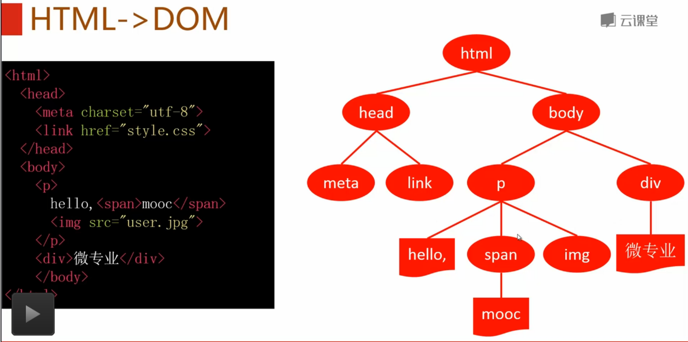

# 1.文档树

##DOM
- Document Object Model


---

- DOM Core
- DOM HTML
- DOM Style
- DOM Event

---

##HTML -> DOM



---
##节点遍历

```javasript
node.parentNode  //父节点
    .firstChild //第一个子节点
    .lastChild  //最后一个子节点
    .previousSibling   //前一个兄弟
    .nextSibling //后一个兄弟节点
```